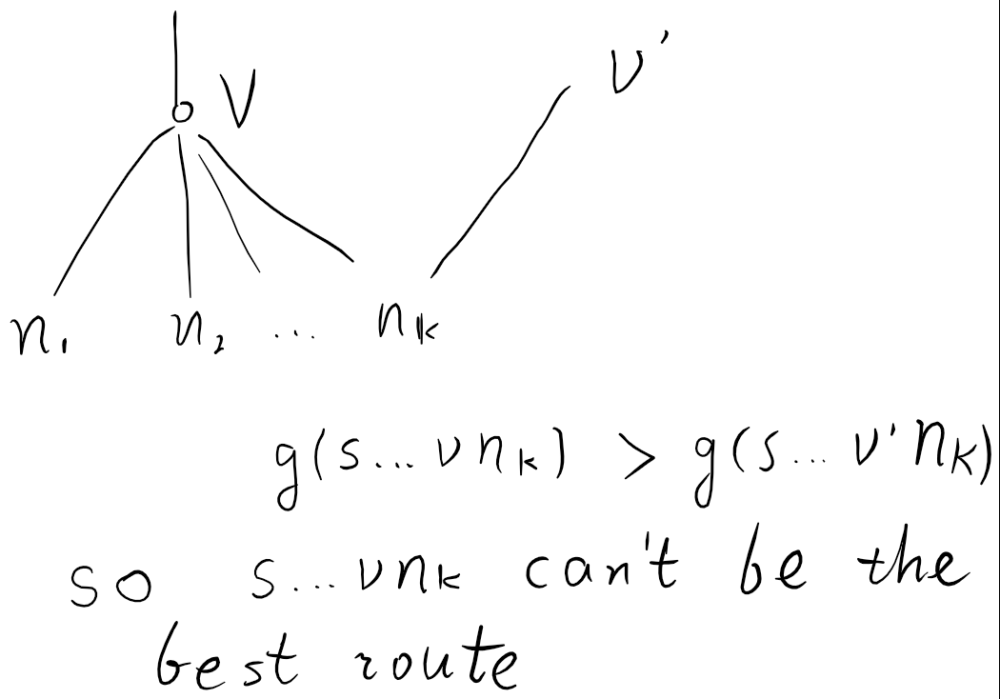

# The least things you need to know about A*(A-Star) Algorithm

- tags: ai, a*, a-star

------

1. A算法的定义
  - 设G=(V,E)是有权无向图, 设s属于V, 设v代表G的某个节点, e代表G的某个边
  - 问题的解集T, 最优解t0: T是V的子集, t0属于T
  - 状态n: 从s到v的某条路径
  - 函数g(n): n的边权之和
  - 函数h*(n): 路径n的终点v到t0的最短路径长度(路径长度即边权之和)
  - 函数h(n): 路径n的终点v到t0的最短长度的估计值(该函数是用户定义的函数)
  - 函数f(n): f(n)=g(n)+h(n)
  - 集合OPEN, 集合CLOSED: 节点v的集合
  - A算法伪代码: (Ruby)

          def a-star(G, s)
            calculate s.f
            # OPEN中的所有元素是已计算好f值的
            OPEN = {s}
            CLOSED = {}
            while not OPEN.is_empty?
              # 取OPEN中f值最小的v
              v = OPEN.remove_fmin
              CLOSED.add v
              return v if v.is_target?
              v.neighbors.each do |neighbor|
                # neighbor已经搜索过了
                next if CLOSED.include? neighbor
                if not OPEN.include? neighbor
                  OPEN.add neighbor
                elsif neighbor.g > neighbor.previous_g
                  # neighbor在OPEN中
                  # 注释1
                  next
                end
                calculate v.f
              end
            end
          end

    注释1: neighbor.g即为g(s...vnk), neighbor.previous_g为g(s...v'nk)
    

2. A*算法的定义
    - 和A算法相同, 但是对任意n, h(n) <= h*(n)

3. 证明A*一定能求得最优解
