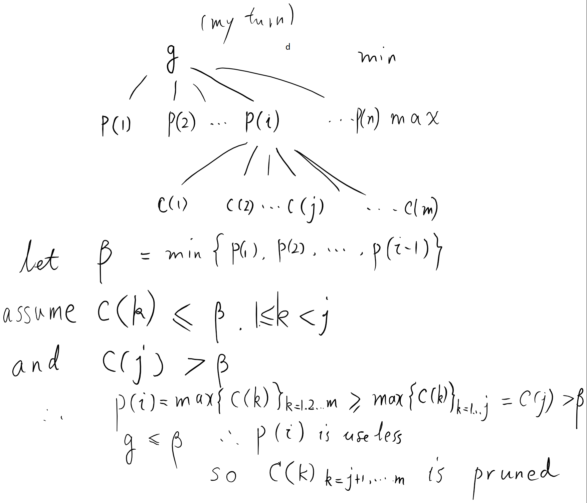

# Alpha-Beta Pruning from the Outside In

- tags: ai, pruning, alpha-beta pruning, minimax, maximin

------

参考了[维基百科](https://en.wikipedia.org/wiki/Minimax?oldformat=true)

## 最大最小算法
- 目的
  - 在某种局面下, 有n种着子方法, 估算这n中着子方法的收益值, 选择收益最大的位置着子
- 前提
  1. 两个玩家
  2. 信息对等
  3. 轮流进行
  4. 零和(每个走法对双方的收益和为0)
  5. 假设双方都理智, 都能尽量使用使对方收益最低己方收益最高的走法
- 定义和性质
  - 己方: 当前着子的一方
  - 对方: 非己方
  - 节点node: 某一时刻的局面
  - MIN节点min_node: 己方已经着子的节点
  - MAX节点max_node: 对方已经着子的节点
  - 节点的估值(收益)v(node): 如果该节点己方胜利为正无穷, 对方胜利为负无穷, 否则
    - 对于MIN节点n, v(n) = min{children(n)}
    - 对于MAX节点n, v(n) = max{children(n)}
    - min为最小值函数, max为最大值函数, children为n的所有孩子节点.
    - 直观理解为: 己方在该处着子的收益是下一步对方在任何地方着子对己方收益的最小值(根据假定5, 对方总会选一个对己方最不利的着法). 反过来类似.

## Alpha-Beta剪枝
- 注释
  - 是最小最大算法的优化, 结果等价
  - 该算法发生在博弈树节点祖孙三代中
- 定义
  - 祖父g:
  - 父亲p(k), k=1,2...n, n是g的孩子个数
  - 当前节点是cu=p(i), i >= 2, cu代表current
  - 对于任意x < i, v(p(x))已知
  - 当前节点cu的孩子节点是c(k), k=1,2...m, m是cu的孩子个数
  - 当前孩子cc=c(j), j >= 2, cc代表current child
- 算法描述
  1. beta剪枝:
    - 假设
      1. g是MIN节点, p(k)为MAX节点, c(k)为MIN节点
      2. beta = min{v(p(1)), v(p(2)),... v(p(i-1))} (注释: p(i)=cu)
      3. 对任意k < j, v(c(k)) <= beta
      4. v(cc) = v(c(j)) > beta, 即c(j)是第一个收益大于beta的c(k)节点
    - 推论
      1. 根据2, v(g) <= beta, beta是v(g)的可能最大值, 即beta是v(p(k))最小值的可能最大值
      2. 根据4, v(cc) > beta, 所以v(c) >= v(cc) > beta, 而v(p) <= beta, 所以v(p) < v(c), 即v(p) != v(c)
      3. 根据推论3, cu对v(p)无影响, 即去掉cu, v(p)不变
    - 剪枝操作
      - 当检测到满足假设中的条件时, 直接跳过所有c(k), k > j节点.
    - 图例
      - 
  2. alpha剪枝: 类似

- 伪代码(Ruby风格)

        def alpha_beta(depth, node, alpha, beta)
          return evaluate(node) if depth == 0
          node.expand_children
          # beta pruning
          if node is MAX
            node.children.each do |c|
              v = alpha_beta(depth-1, c, alpha, beta)
              return alpha if v > beta
              alpha = v if v > alpha
            end
            return alpha
          else
            node.children.each do |c|
              v = alpha_beta(depth-1, c, alpha, beta)
              return beta if v < alpha
              beta = v if v < beta
            end
            return beta
          end
        end
